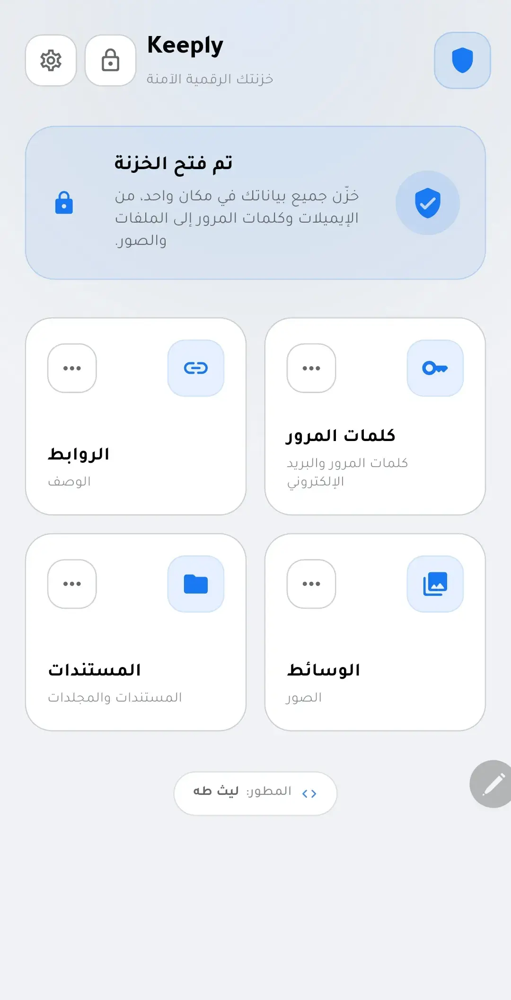
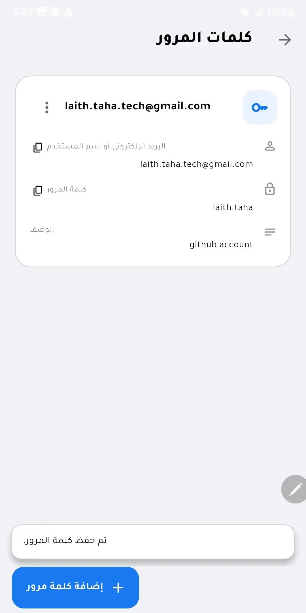
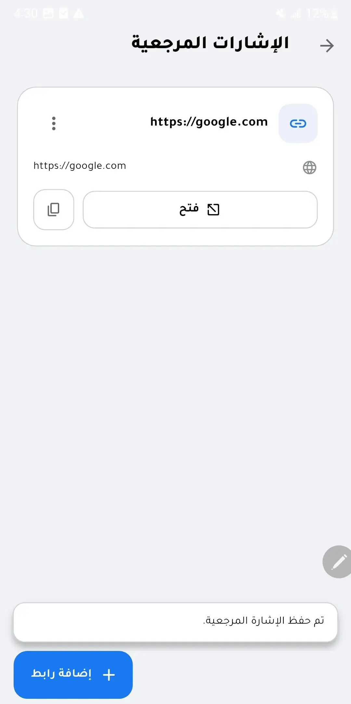
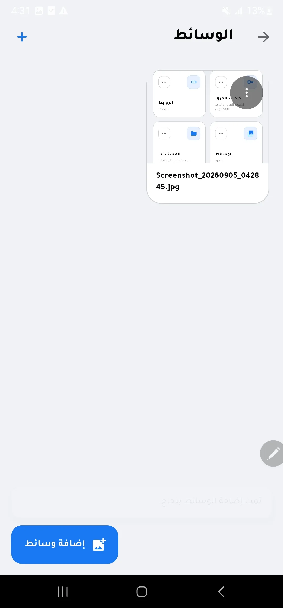
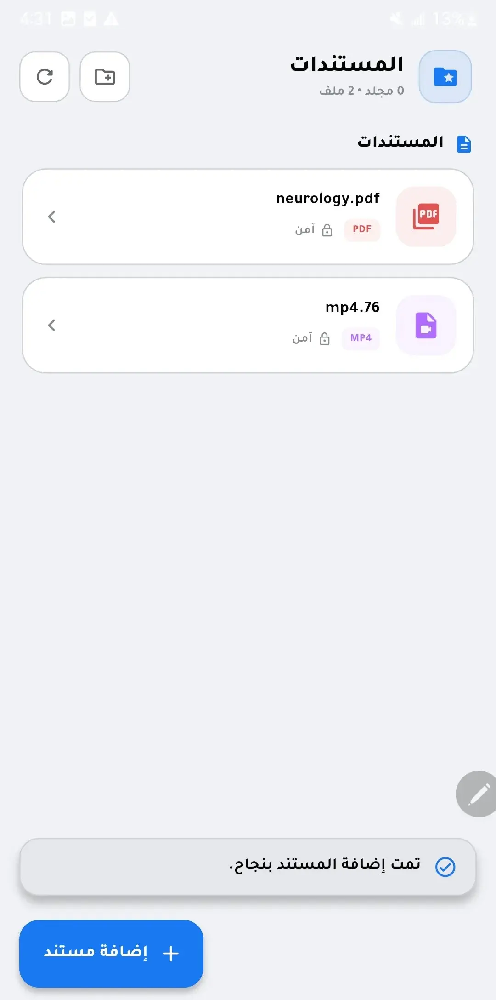
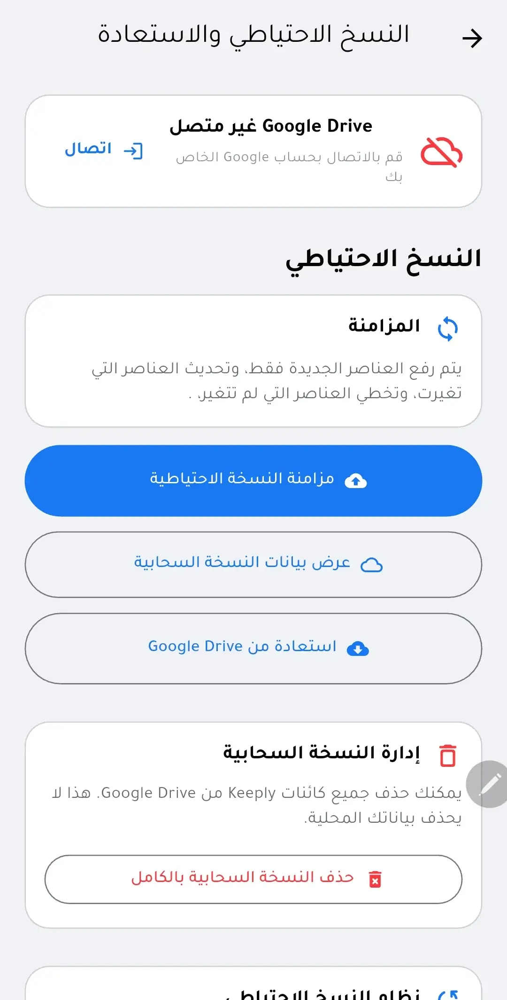
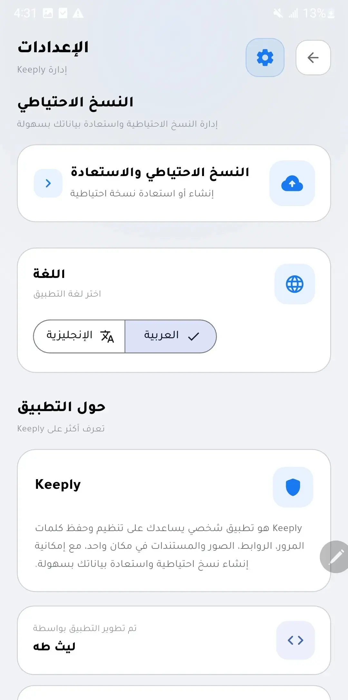

# Keeply

Keeply is a Flutter application for managing passwords, bookmarks, media, documents, and folders in one local vault.

The application is designed around local storage, with optional Google Drive integration for backup and restore.

> **Testing status:** Keeply has currently been tested on Android. Other platforms are included in the Flutter project but have not been fully verified.

---

## 📸 Screenshots

<p align="center">
  
  
  
</p>

<p align="center">
  
  
  
</p>

<p align="center">
  
</p>

---

## ✨ Features

### 🔐 PIN-Protected Vault

* PIN-based authentication
* Secure storage for authentication-related data
* Local vault access without requiring an internet connection

### 🔑 Password Management

Store and manage:

* Username or email
* Password
* Notes

Users can add, edit, delete, hide, reveal, and copy password entries.

### 🔗 Bookmarks

Save and manage website bookmarks with:

* URL
* Description
* Creation date
* Last updated date

URLs are validated and normalized before being stored.

### 🖼️ Media Management

* Import one or multiple media files
* Preview and open media
* Share media
* Save supported media to the device gallery
* Delete media

Media metadata and imported files are stored locally.

### 📁 Files & Folders

* Create and organize folders
* Support nested folders
* Import multiple files
* Open and share files
* Delete files and folders
* Handle common document formats such as PDF, images, TXT, DOCX, XLSX, and PPTX

PDF files can be viewed using the integrated PDF viewer. Other formats are handled according to the capabilities implemented for each file type and the applications available on the device.

---

## ☁️ Google Drive Backup

Keeply supports optional Google Drive backup and restore.

Google Sign-In is used for authentication, while the Google Drive API is used to manage Keeply backup data.

Backup data is organized by type using separate Drive files:

```text
Keeply_Vault_
Keeply_Bookmark_
Keeply_Folder_
Keeply_MediaMeta_
Keeply_MediaData_
Keeply_FileMeta_
Keeply_FileData_
```

Keeply uses Google's `appDataFolder` for its application-specific Drive data.

Internet access is only required for Google Drive backup and restore operations.

---

## 🔄 Incremental Backup

Keeply's backup system compares local data with existing backup data.

SHA-256 hashes are used to detect changes.

The backup process can:

* Upload new data
* Update changed data
* Skip unchanged data
* Remove obsolete backup data

Backup operations use limited concurrency to avoid running too many cloud operations simultaneously.

---

## ♻️ Restore

Restore is designed to add missing backup data to the existing local vault rather than replacing the current local data.

The restore process can restore:

* Password entries
* Bookmarks
* Folders
* Media metadata
* Media files
* File metadata
* File data

Existing local data is preserved during restore.

---

## 💾 Local Storage

Keeply uses **Hive** for local application storage.

The main data categories are stored separately:

```text
secure_vault_items
secure_vault_bookmarks
secure_vault_media
secure_vault_files
secure_vault_folders
```

The primary vault functionality works locally without an internet connection.

---

## 🔒 Security

Keeply includes security-related functionality for authentication and cryptographic operations.

The project includes:

* PIN-based authentication
* Secure storage
* Password-based key derivation
* SHA-256 hashing
* AES-256-CBC encryption functionality

The current application does **not** apply AES encryption to every local Hive record or to Google Drive backup data.

Therefore, Keeply does not currently claim to provide fully encrypted local storage or end-to-end encrypted cloud backups.

---

## 🌍 Localization

Keeply currently supports:

* English
* Arabic

The interface supports both LTR and RTL layouts.

Arabic uses the bundled **Tajawal** font.

---

## 🏗️ Project Structure

Keeply uses a feature-based Flutter project structure:

```text
lib/
├── app/
├── core/
│   ├── backup/
│   ├── cloud/
│   ├── constants/
│   ├── debug/
│   ├── localization/
│   ├── security/
│   ├── storage/
│   └── theme/
│
├── features/
│   ├── auth/
│   ├── backup/
│   ├── bookmarks/
│   ├── files/
│   ├── media/
│   ├── settings/
│   └── vault/
│
└── l10n/
```

---

## 🛠️ Tech Stack

| Technology | Purpose |
| --- | --- |
| Flutter | Application framework |
| Dart | Programming language |
| flutter_bloc | State management |
| Provider | Dependency and state access |
| Hive | Local storage |
| flutter_secure_storage | Secure storage |
| crypto | Hashing and cryptographic operations |
| encrypt | AES encryption functionality |
| Google Sign-In | Google authentication |
| Google APIs | Google Drive integration |
| file_picker | File selection |
| archive | Archive and document processing |
| Syncfusion PDF Viewer | PDF viewing |
| flutter_image_compress | Image compression |
| gal | Gallery operations |
| share_plus | File and media sharing |
| open_filex | Opening files with external applications |
| url_launcher | Opening URLs |

---

## 🚀 Getting Started

### Requirements

Install Flutter and configure your development environment.

Get the project dependencies:

```bash
flutter pub get
```

Check available devices:

```bash
flutter devices
```

Run the application:

```bash
flutter run
```

Or specify a device:

```bash
flutter run -d <device>
```

Google Drive backup and restore require the appropriate Google authentication and API configuration.

---

## 📱 Testing Status

| Platform | Status |
| --- | --- |
| Android | ✅ Tested |
| iOS | ⚠️ Not fully tested |
| Windows | ⚠️ Not fully tested |
| macOS | ⚠️ Not fully tested |
| Linux | ⚠️ Not fully tested |
| Web | ⚠️ Not currently verified |

Android is currently the primary tested platform.

Other platforms are included in the Flutter project configuration but should not be considered fully verified.

---

## 📌 Current Status

Keeply is a working Flutter project with its primary testing focused on Android.

Current implemented areas include:

* PIN-protected vault
* Password management
* Bookmark management
* Media management
* File and folder management
* Local Hive storage
* Arabic and English localization
* Google Drive backup
* Google Drive restore
* Incremental backup synchronization

---

## 📄 License

No open-source license is currently specified for this project.

Until a license is added, the source code should not be assumed to be freely reusable, modified, or redistributed.